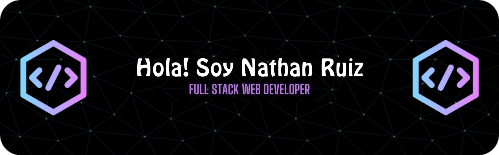

 

<!-- LETRAS MOVIMIENTO -->

 

<!-- FOTO CHICO ORDENADOR -->

 

### SOBRE MI
- Actualmente estoy desarrollando proyectos propios.
- Explorando nuevas tecnologias relacionas con el diseño UX / UI.
- Buscando colaborar en nuevos proyectos y oportunidades laborales.
- Puedes visitar mi <a href="https://nathanruhe.github.io/">Portfolio</a> para ver algunos proyectos.
- Conectamos? [Email](mailto:nathan.ruhe@hotmail.com) / [Linkedin](https://www.linkedin.com/in/nathanruhe) / [Discord](https://discord.com/users/1102680805261725767)
- Dato curioso: "No hay lugar como localhost"

<!-- RALLA COLOR MOVIMIENTO -->

### SKILLS
#### Frontend 

#### Backend 

#### Tools, IDEs & Softwares

#### Design

<!-- RALLA COLOR MOVIMIENTO -->

### ESTADISTICAS

    
    

 

<!-- RALLA COLOR MOVIMIENTO -->

### CERTIFICACIONES

    
    
    
    
    

<!-- RALLA COLOR MOVIMIENTO -->

<!-- CONTACTAME -->
### CONTACTO

  
  
  
  
  
  <!--
  
  
   -->
 

<b>Gracias por visitarme!</b>

<!-- 

 -->

